<div align="center">

  <!-- Animated SVG Header Banner -->
  

  <br><br>

  <!-- Dark Gothic Pure Monochrome Badge Row -->
  <p align="center">
    
    
    
    
    
    
    
    
    <a href="https://opensource.org/licenses/MIT"></a>
  </p>

  <br>

  <p align="center">
    <a href="editor.html">📁 <b>Open App Desk</b></a> &nbsp;·&nbsp;
    <a href="index.html">🖤 <b>Open Landing Page</b></a> &nbsp;·&nbsp;
    <a href="https://opensource.org/licenses/MIT">📜 <b>MIT License</b></a>
  </p>

</div>

<p align="center">─────── 🕇 ───────</p>

## About

Notes 101 is a minimal, dark-themed note-taking web app.

It was designed in **Photoshop**, **Illustrator**, and **Figma**, then built using plain HTML, CSS, JavaScript, GSAP, and Firebase.

It is 100% free, has no ads, no subscriptions, and runs directly in your web browser.

---

## Animated Effects

1. **Animated SVG Banner**: Dynamic border pulsing, line drawing, and glowing title animations at the top of the README.
2. **Scroll Animations**: Smooth scrolling on the landing page (`index.html`) with scroll-triggered text reveals and screenshot zoom effects.
3. **Curtain Reveal Footer**: Contact footer anchored behind the page that reveals when scrolling to the bottom.

---

## Features

### 1. Editor & Workspace
- **A4 Page Layout**: Notes render as A4 sheets with automatic page splitting when text overflows.
- **Sidebar Tree**: Organize notes into folders, books, and pages.
- **Text Search**: Document search bar to scan pages with match counters and highlight markers.

### 2. Typography & Formatting
- **100+ Google Fonts**: Dropdown menu to switch fonts (Sumana, Inter, Fira Code, Caveat, Playfair Display, etc.).
- **Text Formatting**: Bold, italic, underline, alignment (left, center, right), line spacing, bullet lists, numbered lists, and checklists.
- **Font Sizes**: Preset text sizing for small, medium, and large.

### 3. Color Pickers
- **Text Color**: HSL spectrum canvas with hue slider and HEX input.
- **Highlights**: Preset swatches for highlighting text.
- **Canvas Background**: Change page background shade (dark mode, warm ivory, pure white).
- **Ink Color**: Color selector for drawing lines.

### 4. Canvas Drawing Layer
- **Freehand Sketching**: Draw directly on top of note pages.
- **Tools**: Fountain pen, pencil, art brush, and eraser.
- **Stroke Sizes**: Fine (2px), medium (6px), and thick (14px).

### 5. Media & Export
- **Insert Media**: Upload images and insert data tables.
- **PDF Export**: Download notes as PDF files with one click.

### 6. Cloud Sync
- **Google Sign-In**: Login with Google via Firebase Auth.
- **Background Sync**: Notes auto-save to Firestore database per user.
- **Offline Storage**: Local browser storage backup when offline.

---

## Software & Technologies Used

- **Design Software**: Adobe Photoshop, Adobe Illustrator, Figma
- **Frontend**: HTML5, CSS3, JavaScript (ES6+)
- **Scroll & Motion**: GSAP, ScrollTrigger, Lenis
- **Backend & Storage**: Firebase Auth, Cloud Firestore
- **PDF Compiler**: html2pdf.js, html2canvas, jsPDF

---

## Keyboard Shortcuts

| Shortcut | Function |
| :--- | :--- |
| `Ctrl + B` / `Cmd + B` | Bold |
| `Ctrl + I` / `Cmd + I` | Italic |
| `Ctrl + U` / `Cmd + U` | Underline |
| `Ctrl + F` / `Cmd + F` | Search notes |

---

## Local Setup

1. Clone the repository:
   ```bash
   git clone https://github.com/anamrazzaque/ai-note.git
   ```
2. Run a local server:
   ```bash
   python3 -m http.server 8000
   ```
3. Open `http://localhost:8000/index.html` (or `http://localhost:8000/`) in your browser.

---

## License

Licensed under the **MIT License**. Free to use, modify, and share.

<p align="center">
  <sub>Notes 101 · Designed in Photoshop, Illustrator & Figma · MIT License</sub>
</p>
