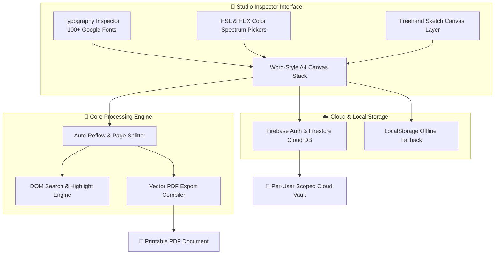

<div align="center">

  <!-- Main Hero Title Banner -->
  <h1><code>📝 NOTES 101</code></h1>

  <h3>A Photoshop, Illustrator & Figma Crafted Digital Desk & Editorial Note Platform</h3>

  <p>
    <em>“Where modern design tools meet high-performance typography, digital canvas drawing, and real-time cloud synchronization.”</em>
  </p>

  <!-- Animated Tech Badges -->
  <p>
    <a href="https://developer.mozilla.org/en-US/docs/Web/HTML"></a>
    <a href="https://developer.mozilla.org/en-US/docs/Web/CSS"></a>
    <a href="https://developer.mozilla.org/en-US/docs/Web/JavaScript"></a>
    <a href="https://www.adobe.com/products/photoshop.html"></a>
    <a href="https://www.adobe.com/products/illustrator.html"></a>
    <a href="https://www.figma.com/"></a>
    <a href="https://greensock.com/gsap/"></a>
    <a href="https://firebase.google.com/"></a>
    <a href="https://opensource.org/licenses/MIT"></a>
  </p>

  <br />

  <!-- Action Links -->
  <p>
    <a href="index.html"><strong>🚀 Open Web Application Desk</strong></a> ·
    <a href="landing.html"><strong>📰 View Hermes Editorial Landing Page</strong></a> ·
    <a href="https://opensource.org/licenses/MIT"><strong>📜 MIT License</strong></a>
  </p>

</div>

<hr />

## 📰 Editorial Manifesto & Design Origins

> *“Most note-taking applications either feel like spreadsheet software disguised as text editors or corporate workspace tools bloated with subscriptions. **Notes 101** was born out of stealing the vibe of Photoshop inspector panels, VS Code command aesthetics, and Hermes print editorial newspapers to create a digital desk environment that feels alive.”*

```
─── EDITORIAL EDITION NO. 01 ────────────────────────────────────────────────────────
DESIGNED ON : ADOBE PHOTOSHOP · ADOBE ILLUSTRATOR · FIGMA
ENGINE      : VANILLA JS (ES6+) · GSAP 3 · LENIS SMOOTH SCROLL · FIREBASE V10
LICENSE     : MIT OPEN-SOURCE LICENSE (100% FREE · NO ADS · NO SUBSCRIPTIONS)
─────────────────────────────────────────────────────────────────────────────────────
```

---

## ⚡ System Architecture & Data Flow



---

## 💎 Feature Deep-Dive

<details open>
<summary><h3>🗞️ 01. Hermes Editorial Landing Page & Motion System</h3></summary>

The landing page (`landing.html`) is modeled after luxury editorial newspapers and high-fashion print layouts.

- **Hermes Curtain Reveal**: Fixed-position contact section (`.contact`) anchored behind the main scrolling canvas, gracefully revealed as the editorial newspaper lifts away.
- **Lenis Smooth Scroll Integration**: High-frequency inertial scroll engine synced to `gsap.ticker` with zero lag smoothing.
- **GSAP Character Stagger Reveals**: Text reveal effects splitting headlines into individual letter elements (`.promo__heading-char`) with progressive blur-to-sharp transitions.
- **App Screenshot Zoom-Out FX**: Continuous scroll-scrubbed scale transformation (`scale: 0.65` to `scale: 1.0`) for real-time visual pop.
- **Responsive 1920px Canvas Scaling**: Responsive wrapper recalculating aspect scale factors on browser viewport resizing or orientation changes.

</details>

<details>
<summary><h3>📚 02. Word-Style A4 Document Engine & Reflow</h3></summary>

- **A4 Digital Desk Pages**: Clean white/ivory contenteditable pages rendered with exact print dimensions (`210mm x 297mm` equivalent aspect ratio).
- **Auto-Page Reflow Engine**: Real-time content height calculator that detects overflow (`scrollHeight > clientHeight`) and automatically pushes trailing nodes onto newly spawned pages.
- **Tree-View Workspace Management**: Dynamic sidebar hierarchy supporting Folders, Books, and nested Pages with live title syncing and state persistence.
- **Automatic Page Cleanup**: Empty auto-generated pages are dynamically detected and garbage-collected when text is deleted.

</details>

<details>
<summary><h3>🔤 03. Studio Typography Engine (100+ Google Fonts)</h3></summary>

- **Comprehensive Google Fonts Library**: Instant real-time font switching across 100+ typography families:
  - *Serif & Editorial*: Sumana, EB Garamond, Playfair Display, Lora, Cormorant Garamond, Cinzel.
  - *Sans-Serif & Modern*: Inter, Roboto, Montserrat, Outfit, Poppins, Work Sans, Syne.
  - *Handwriting & Creative*: Caveat, Dancing Script, Pacifico, Homemade Apple, Kalam, Sacramento.
  - *Monospace & Tech*: Fira Code, JetBrains Mono, Space Mono, Courier Prime, Inconsolata.
- **Font Formatting Bar**: One-click toggles for Bold (`<b>`), Italic (`<i>`), Underline (`<u>`), Left / Center / Right alignment, line-height spacing, bullet lists, numbered lists, and interactive checklists.

</details>

<details>
<summary><h3>🎨 04. Dual HSL / HEX Color Spectrum Pickers</h3></summary>

- **Text Color Spectrum**: Custom HTML5 Canvas spectrum box rendering dynamic HSL gradients with a smooth hue slider, HEX badge display, and native input fallbacks.
- **Aesthetic Text Highlight Swatches**: 12 curated pastel highlight tones (Yellow, Mint, Lavender, Coral, Soft Red, Lime, Gold, Cyan, Orange, Pink).
- **Canvas Shading Engine**: Change canvas background shading (Dark Mode `#191919`, Warm Ivory `#fcf5e5`, Pure White `#ffffff`, or custom spectrum color).
- **Ink Color Selector**: Dedicated color palette for drawing over note pages.

</details>

<details>
<summary><h3>🖌️ 05. Layered Freehand Sketch & Drawing Canvas</h3></summary>

- **Multi-Layer Drawing Overlay**: Every page features an interactive HTML5 canvas overlay positioned above text content.
- **Tool Modes**:
  - `Text Mode`: Type and format text normally.
  - `Fountain Pen`: Fluid line stroke rendering.
  - `Pencil`: Fine-grain sketch pencil mode.
  - `Art Brush`: Expressive brush stroke simulation.
  - `Eraser`: Precise stroke erasing layer.
- **Stroke Thickness Preset Pill**: Instant switching between **FINE (2px)**, **MEDIUM (6px)**, and **THICK (14px)**.

</details>

<details>
<summary><h3>📄 06. PDF Compiler & Media Insertion Suite</h3></summary>

- **Vector PDF Export Engine**: One-click PDF compilation combining text DOM nodes and canvas drawing layers using `html2pdf.js`, `html2canvas`, and `jsPDF`.
- **Local Image Upload**: Drag-and-drop or file upload input for inserting photos and assets directly onto pages.
- **Formatted Table Insertion**: Instant insertion of styled HTML data tables.
- **Deep Note Link Sharing**: Copy direct URLs to launch specific books and page IDs.

</details>

<details>
<summary><h3>🔍 07. Real-Time Document Search Engine</h3></summary>

- **DOM TreeWalker Search**: High-performance DOM walker traversing text nodes without corrupting event listeners.
- **Live Match Counter**: Dynamic badge displaying current match index and total match count (`1/8`).
- **Highlight Navigation**: Forward/backward match jumping with auto-scrolling to highlighted `<mark>` nodes.

</details>

<details>
<summary><h3>☁️ 08. Firebase Auth & Per-User Cloud Isolation</h3></summary>

- **Google Authentication**: Built with Firebase Web SDK v10 supporting Popup auth and Browser Redirect mode fallback.
- **Per-User Cloud Firestore Vault**: Automatic debounced background syncing (`500ms`) to user-scoped Firestore documents (`users/{uid}/notes/workspace`).
- **Local Storage Cache**: Fallback state management ensuring zero data loss even during network disconnections.

</details>

---

## 📊 Feature Comparison Matrix

| Feature | **Notes 101** | Standard Note Apps | Corporate SaaS Apps |
| :--- | :---: | :---: | :---: |
| **Design Inspiration** | **Photoshop, Illustrator, Figma** | Generic Native UI | Flat Material / Bootstrap |
| **Subscription Fee** | **100% FREE (Forever)** | $8 - $15 / month | $12 - $30 / month |
| **Ads & Tracking** | **ZERO Ads** | Frequent Upsells | Data Tracking |
| **Google Fonts** | **100+ Integrated** | 3 - 5 Fonts | Limited System Fonts |
| **Freehand Drawing over Text** | **YES (Layered Canvas)** | Rare / Separate View | No |
| **Color Spectrum Picker** | **YES (HSL + HEX Slider)** | Preset Swatches | Basic Palette |
| **PDF Export Engine** | **YES (1-Click Compiled)** | Paid Tier Only | Export Limits |
| **Open Source (MIT License)** | **YES (Fully Open)** | Closed Source | Closed Source |

---

## 🎨 Design System & Color Tokens

```css
/* Core Studio Palette Tokens */
--color-bg-workspace : #191919;  /* Photoshop Dark Desk */
--color-bg-card      : #242424;  /* Studio Inspector Card */
--color-accent-gold  : #fcf5e5;  /* Editorial Cream */
--color-accent-red   : #e04040;  /* Spectrum Red Accent */
--color-accent-blue  : #4080e0;  /* Studio Active Blue */
--color-success      : #4caf50;  /* Cloud Sync Green */
--color-warning      : #ff4d4f;  /* Logout / Caution Red */
```

---

## ⌨️ Studio Keyboard Shortcuts

| Shortcut | Action |
| :--- | :--- |
| `Cmd / Ctrl + B` | Toggle **Bold** Text Formatting |
| `Cmd / Ctrl + I` | Toggle *Italic* Text Formatting |
| `Cmd / Ctrl + U` | Toggle <u>Underline</u> Text Formatting |
| `Cmd / Ctrl + F` | Focus Studio Search Bar |
| `Esc` | Clear Search Highlights / Close Color Spectrum Popups |

---

## 💻 Local Quickstart & Development

### Prerequisites
A modern web browser (Chrome, Safari, Firefox, Edge).

### 1. Clone the repository
```bash
git clone https://github.com/anamrazzaque/ai-note.git
cd ai-note
```

### 2. Launch Local Development Server
Because Firebase Auth ES Modules require an HTTP/HTTPS protocol, serve the project root via any local server:

**Option A — Python (Built-in):**
```bash
python3 -m http.server 8000
```
Navigate to `http://localhost:8000/landing.html` in your browser.

**Option B — Node.js `npx serve`:**
```bash
npx serve ./
```

**Option C — VS Code Live Server Extension:**
Right-click `landing.html` -> **Open with Live Server**.

---

## 📜 License & Open Source Freedom

This project is licensed under the **MIT License** — permitting free personal and commercial use, modification, distribution, and private hosting without restriction.

```text
MIT License

Copyright (c) 2026 Notes 101

Permission is hereby granted, free of charge, to any person obtaining a copy
of this software and associated documentation files (the "Software"), to deal
in the Software without restriction, including without limitation the rights
to use, copy, modify, merge, publish, distribute, sublicense, and/or sell
copies of the Software, and to permit persons to whom the Software is
furnished to do so, subject to the following conditions:

The above copyright notice and this permission notice shall be included in all
copies or substantial portions of the Software.

THE SOFTWARE IS PROVIDED "AS IS", WITHOUT WARRANTY OF ANY KIND, EXPRESS OR
IMPLIED, INCLUDING BUT NOT LIMITED TO THE WARRANTIES OF MERCHANTABILITY,
FITNESS FOR A PARTICULAR PURPOSE AND NONINFRINGEMENT. IN NO EVENT SHALL THE
AUTHORS OR COPYRIGHT HOLDERS BE LIABLE FOR ANY CLAIM, DAMAGES OR OTHER
LIABILITY FROM BACKEND, CONTRACT, TORT OR OTHERWISE, ARISING FROM, OUT OF OR
IN CONNECTION WITH THE SOFTWARE OR THE USE OR OTHER DEALINGS IN THE SOFTWARE.
```

---

<div align="center">
  <b>Notes 101 — Designed on Photoshop, Illustrator & Figma</b><br>
  <sub>Licensed under the MIT Open-Source License</sub>
</div>
